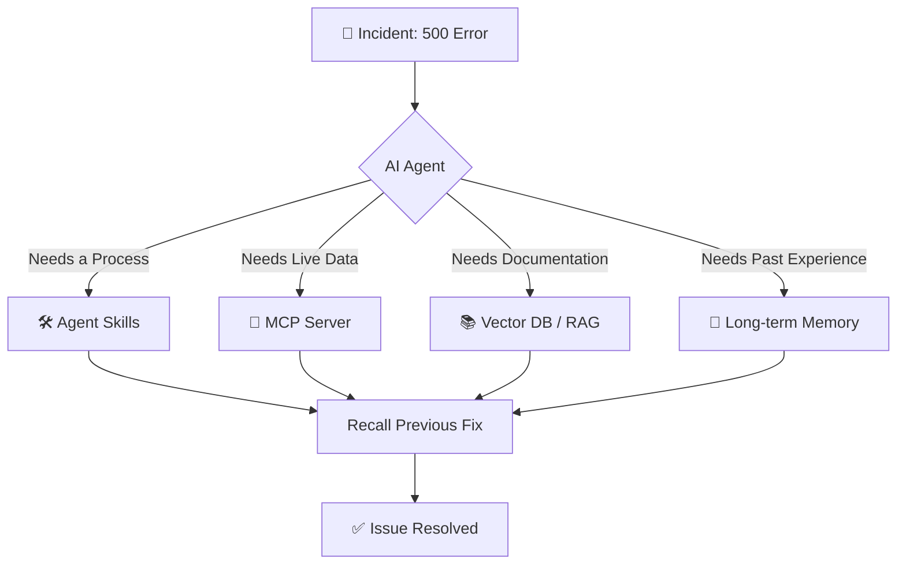

# 🤖 AI Agent Knowledge Hub

### *Architecting Intelligence, Connectivity, and Memory*

Welcome to the AI Agent Knowledge Framework. This wiki provides a comprehensive guide on how to equip AI agents with the specific, real-time, and proprietary knowledge they need to solve complex production problems without relying solely on their initial training data.

---

## 🎯 The Core Problem: "Context Stuffing"
When an AI agent faces a complex task (e.g., **a 500 Internal Server Error**), the instinctive reaction is to dump all available runbooks, logs, and dashboards into the context window. 

**Why this fails:**
- 📉 **Noise:** The agent gets overwhelmed by irrelevant data.
- 🌀 **Hallucinations:** The agent makes generalized guesses instead of precise fixes.
- 💸 **Cost:** Excessive token usage increases latency and expense.

**The Solution:** A modular approach to knowledge retrieval using **Skills, MCP, RAG, and Memory.**

---

## 🗺️ Navigation Map

Select a module below to dive deep into the implementation details:

| Module | Focus | Best For... | Link |
| :--- | :--- | :--- | :--- |
| **🛠️ Agent Skills** | **Procedures** | Repeatable steps & human-defined judgment. | [Go to Skills ](https://github.com/alishahbaz/AI-Agent-Knowledge-Hub/wiki/Agent-Skills.md) |
| **🧠 Modern AI** | **Foundations** | LLMs, RAG, MCP, and basic concepts. | [Go to Basics ](https://github.com/alishahbaz/AI-Agent-Knowledge-Hub/wiki/Modern-AI-Basics.md) |
| **🛡️ Agentic Security** | **Runtime Safety** | Harness security, threat modeling & IR. | [Go to Agentic Sec ](https://github.com/alishahbaz/AI-Agent-Knowledge-Hub/wiki/Security-Agentic.md) |
| **🔐 LLM Security** | **Model Safety** | Prompt injection, data privacy & guardrails. | [Go to LLM Sec ](https://github.com/alishahbaz/AI-Agent-Knowledge-Hub/wiki/Security-LLM.md) |

---

## ⚙️ System Architecture at a Glance

The following diagram illustrates how an agent orchestrates these four knowledge sources to resolve a production incident:

---

## 🚀 Quick Start Guide
*Not sure where to start? Follow this path:*

1. **New to Agents?** Start with [**Modern AI Basics**](https://github.com/alishahbaz/AI-Agent-Knowledge-Hub/wiki/Modern-AI-Basics.md) to understand the core components.
2. **Building a Skill?** Jump to [**Agent Skills**](https://github.com/alishahbaz/AI-Agent-Knowledge-Hub/wiki/Agent-Skills.md) for best practices on `skill.md` and scripts.
3. **Building a Production App?** Read [**Agentic Security**](https://github.com/alishahbaz/AI-Agent-Knowledge-Hub/wiki/Security-Agentic.md) and [**LLM Security**](https://github.com/alishahbaz/AI-Agent-Knowledge-Hub/wiki/Security-LLM.md) first.

---

## Key Takeaways
A useful modern AI system is not just a model. It is:

> A trained brain, grounded with current knowledge, connected to tools, coordinated through protocols, and constrained by clear rules.
